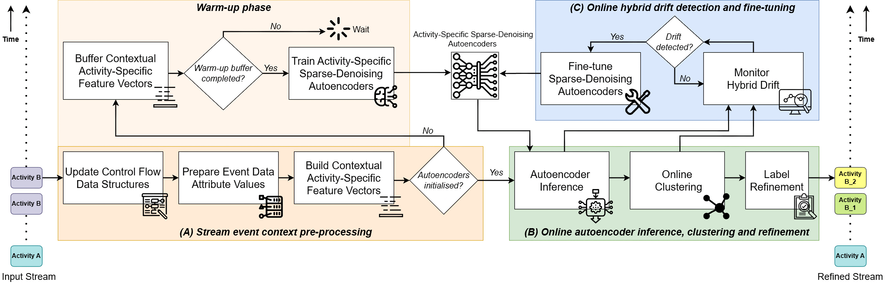
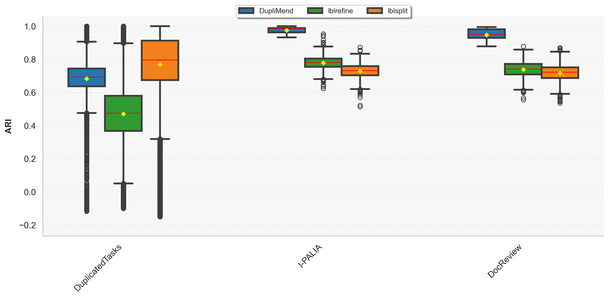
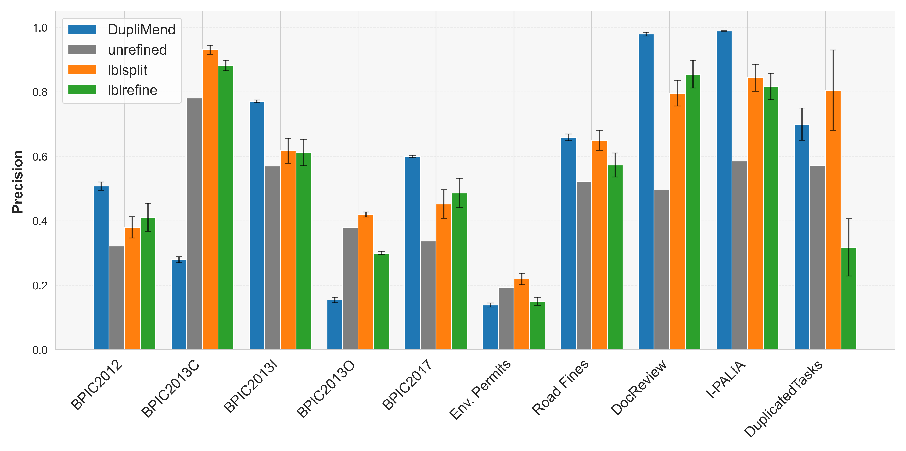
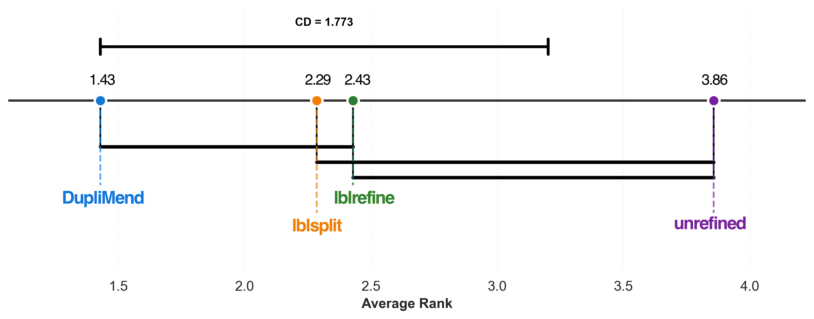
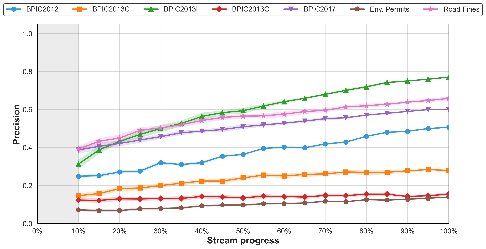

# DupliMend: Online Detection and Refinement of Imprecise Activity Labels

[]()
[](https://www.python.org/)
[](https://pytorch.org/)
[](LICENSE)

Source code (re-initialised from a legacy repository for this new release) and additional resources for the paper **"DupliMend: Online Detection and Refinement of Imprecise Activity Labels"** by Savandi Kalukapuge, Andrzej Janusz, and Moe Thandar Wynn (CAiSE 2026).

## ⭐ Key Novel Contributions

1. **A streaming, unsupervised framework that detects and refines homonymous activity labels on-the-fly without prior specification, complete traces, or full-log analysis.**  

2. **Activity-specific sparse denoising autoencoders that learn multi-perspective representations and enable dynamic splitting and merging of label variants as behaviour evolves through online machine learning, specifically, online clustering.**  

3. **A drift-aware continual learning mechanism combining ADWIN, cluster regularisation, and centroid memory replay to maintain stability and prevent forgetting under evolving process event streams.**  

## Approach High-Level Overview


## 📊 Key Experimental Results

**Clustering quality (ARI) on synthetic PESs**



**Discovered model precision across all PESs**



**Statistical comparison of precision (Friedman + Nemenyi)**



**Precision convergence over the stream (real-life PESs)**




## 📚 Comprehensive Experimental Results

The full experimental results are available at: 👉 **(https://www.dropbox.com/scl/fo/qfxvyagrczl68hiq1xd17/ANasY83Ti-5otlTkbnrYmW8?rlkey=yocrf8hy63euj8hwodfq2kids&st=e2ng9b3v&dl=0)**

Optimised hyperparameter values from Bayesian optimisation are available in:  
`src/bayesian_optimization/`

## Installation

### Prerequisites

- Python 3.11 or higher
- CUDA-capable GPU (optional, for faster training)

### Setup

```bash
# Clone the repository
git clone https://github.com/Savandi/DupliMend.git
cd DupliMend

# Create virtual environment (recommended)
python -m venv venv
source venv/bin/activate  # Linux/Mac
# or
venv\Scripts\activate     # Windows

# Install dependencies
pip install -r requirements.txt
```

### Key Dependencies

- `torch` (2.0.1+) - Deep learning framework for SDAE
- `scikit-learn` - Clustering and evaluation metrics
- `pandas` - Data manipulation
- `pm4py` - Process mining utilities
- `optuna` - Bayesian hyperparameter optimization
- `river` (0.21.0) - Online machine learning (DBSTREAM clustering, ADWIN drift detection)

## Usage

### Basic Execution

Run DupliMend on a CSV event log:

```bash
python main.py \
    --input_csv path/to/event_log.csv \
    --output_dir results/output \
    --case_id_column CaseID \
    --activity_column Activity \
    --timestamp_column Timestamp \
    --training_approach online
```

### Required CSV Format

Your event log CSV should contain at minimum:
- **Case ID column**: Unique identifier for each process instance (trace)
- **Activity column**: The activity label (may contain homonymous labels)
- **Timestamp column**: Event timestamp for temporal ordering

Example:
```csv
CaseID,Activity,Timestamp,Resource,Amount
1,Submit application,2024-01-01 09:00:00,John,1000
1,Review document,2024-01-01 10:00:00,Mary,1000
1,Approve request,2024-01-01 11:00:00,Admin,1000
```

### Configuration Options

Key parameters can be set via command line or environment variables:

**Model Architecture Parameters** (optimized via Bayesian optimization):
```bash
--latent_dim 32              # Autoencoder latent dimension (dz)
--dropout_rate 0.2           # Dropout regularization
--learning_rate 0.001        # Training learning rate (η)
--variance_threshold 0.5     # Reconstruction error threshold
```

**Operational Parameters** (for sensitivity analysis):
```bash
--clustering_threshold 0.3   # Cosine dissimilarity threshold (ε)
--ADWIN_delta 0.002          # Drift detection sensitivity (δ)
--warmup_events 1000         # Events before inference begins (n_warmup)
--max_centroids 100          # Maximum clusters per activity
--temporal_decay_rate 0.1    # Cluster weight decay rate (β)
```

### Hyperparameter Optimization

DupliMend uses Bayesian optimization with the TPE sampler in Optuna:

```bash
# Fast mode (3-fold, 20 trials)
python optimize_duplimend_bayesian.py \
    --dataset document_review_2000 \
    --mode fast

# Full optimization (5-fold, 50 trials)
python optimize_duplimend_bayesian.py \
    --dataset document_review \
    --mode full
```

See [`BAYESIAN_OPTIMIZATION_AND_SENSITIVITY_ANALYSIS.md`](BAYESIAN_OPTIMIZATION_AND_SENSITIVITY_ANALYSIS.md) for the complete optimization methodology.

## Evaluation

### With Ground Truth Labels

For synthetic PESs with available ground truth, clustering quality is measured using supervised metrics:

```bash
python src/evaluation/evaluate_single_test_file.py \
    --tracking_dir results/tracking_20250101_120000 \
    --ground_truth data/ground_truth.csv \
    --output_dir results/evaluation
```

### Without Ground Truth (Real-Life PESs)

For real-life PESs without ground truth, use unsupervised metrics:

```bash
python src/evaluation/evaluate_expected_entropy.py \
    --tracking_dir results/tracking_output \
    --output_dir results/entropy_evaluation
```

### Metrics Computed

**Clustering Quality (Supervised):**
- Adjusted Rand Index (ARI) - alignment with ground truth, adjusted for chance
- Normalised Mutual Information (NMI) - information-theoretic cluster-label agreement
- Expected Entropy (Cluster) - entropy of ground truth labels within clusters
- Expected Entropy (Label) - entropy of cluster assignments per ground truth label

**Clustering Quality (Unsupervised):**
- Silhouette Score - cohesion and separation measure

**Discovered Model Quality:**
- Log Fitness (Recall) - fraction of log behaviour reproducible by the model
- Log Precision - fraction of model behaviour observed in the log
- F-score (harmonic mean of Precision and Fitness)

**Streaming Performance:**
- Convergence Speed - accuracy at intermediate checkpoints (25%, 50%, 75%, 100%)
- Throughput - events processed per second
- Latency (ms/event)
- Peak Memory Usage (MB)

## Experimental Evaluation

This section provides comprehensive details on the experimental setup used to evaluate DupliMend. The conference paper version contains a condensed subset; this repository documents the full methodology.

### Input Data

#### Synthetic Process Event Streams (PESs)

| Dataset | Events | Cases | Variants | Activities | Attributes | Avg Case Length | Description |
|---------|--------|-------|----------|------------|------------|-----------------|-------------|
| **DuplicatedTasks** | ~1,000/log | 1,000/log | varies | varies | 0 | varies | 1,295 synthetic logs from [4TU](https://data.4tu.nl/articles/_/12718226/1) with injected homonyms (Lu et al., BPM 2016) |
| **I-PALIA** | 8,415 | 990 | - | 8 (10 GT) | - | ~8.5 | Healthcare workflow with duplicated activity "A" appearing as A_Start, A_Middle, A_End |
| **DocReview** | 158,855 | 20,090 | - | 10 (11 GT) | 4 | ~7.9 | Document review workflow with multi-attribute events (priority, file size, processing time, resource) |

#### Real-Life Process Event Streams

| PES | Events | Cases | Variants | Activities | Attributes | Avg Case Length | Avg Case Duration (days) | Stream Duration (days) |
|-----|--------|-------|----------|------------|------------|-----------------|--------------------------|------------------------|
| **BPIC2012** | 262,200 | 13,087 | 4,366 | 36 | 3 | 20 | 8.6 | 165 |
| **BPIC2013C** | 6,660 | 1,487 | 327 | 7 | 9 | 4 | 179.2 | 2,332 |
| **BPIC2013I** | 65,533 | 7,554 | 2,278 | 13 | 9 | 9 | 12.1 | 784 |
| **BPIC2013O** | 2,351 | 819 | 182 | 5 | 7 | 3 | 58.7 | 2,047 |
| **BPIC2017** | 1,202,267 | 31,509 | 15,930 | 26 | 15 | 38 | 21.9 | 397 |
| **Road Fines** | 561,470 | 150,370 | 231 | 11 | 13 | 4 | 341.6 | 4,891 |
| **Env. Permits** | 8,577 | 1,434 | 116 | 27 | 8 | 6 | 5.4 | 479 |

#### Large-Scale Dataset: CybersecIoT

| Metric | Value |
|--------|-------|
| **Total Events** | 38,399,367 |
| **Total Cases/Traces** | 648,539 |
| **Event Attributes** | 40 |
| **Ground Truth Labels** | 77 |
| **Training Files** | 15,027 |
| **Test Files** | 5,017 |
| **Avg Traces/File** | 32.36 |
| **Avg Events/Trace** | 59.21 |

This IoT cybersecurity dataset was collected from Raspberry Pi devices executing HTTP traffic and attacks (Janusz et al., 2025). Homonymous labels were constructed as combinations of system call (SYSCALL_syscall) and user group (PROCESS_uid), with ground truth extending to include success status (SYSCALL_success).

### Data Sources

All datasets are publicly available:
- **DuplicatedTasks**: [4TU Repository](https://data.4tu.nl/articles/_/12718226/1)
- **I-PALIA**: [4TU Repository](https://data.4tu.nl/articles/_/12693914)
- **BPIC2012**: [4TU Repository](https://data.4tu.nl/articles/_/12689204/1)
- **BPIC2013**: [4TU Repository](https://data.4tu.nl/articles/_/12693914)
- **BPIC2017**: [4TU Repository](https://data.4tu.nl/articles/_/12696884/1)
- **Road Fines**: [4TU Repository](https://data.4tu.nl/articles/_/12683249/1)
- **Env. Permits**: [4TU Repository](https://data.4tu.nl/articles/_/12709127/2)

---

### Experimental Setup

#### Data Splitting Strategy

Each single-stream file is temporally ordered and partitioned into three sequential streams:

| Stream | Proportion | Purpose |
|--------|------------|---------|
| **Training** | 60% | Warm-up training for autoencoders |
| **Validation** | 20% | Hyperparameter configuration evaluation |
| **Test** | 20% | Final unbiased evaluation (strictly isolated) |

For **CybersecIoT** (multi-file dataset):
- Training subset: 12,000 files (80% of 15,027 training files)
- Validation subset: 3,027 files (20% of training files)
- Test stream: 5,017 files (pre-defined split)

#### Operational Modes

| Mode | Description | Used For |
|------|-------------|----------|
| **Online-Online** | Full online adaptation with ADWIN drift detection and autoencoder retraining | All PESs except CybersecIoT |
| **Offline-Online** | Autoencoders trained offline, frozen during inference; clustering adapts online | CybersecIoT (for scalability) |

---

### Hyperparameter Optimisation

#### Dataset Grouping Strategy

PESs are grouped by shared characteristics for group-level Bayesian optimisation:

| Group | Name | Datasets | Trials | Objective | Mode |
|-------|------|----------|--------|-----------|------|
| 1 | Synthetic PESs | DuplicatedTasks, I-PALIA, DocReview | 75 | ARI | Online-Online |
| 2 | Real-life Low-Moderate | BPIC2012, BPIC2013I, Env. Permits | 75 | Silhouette | Online-Online |
| 3 | Real-life High Complexity | BPIC2017, Road Fines | 100 | Silhouette | Online-Online |
| 4 | Large-scale PESs | CybersecIoT | 150 (100+50) | ARI | Offline-Online |

**Total: 400 optimisation trials** (~150 GPU hours)

#### Hyperparameter Search Space

| Component | Parameter | Search Space |
|-----------|-----------|--------------|
| **Autoencoder** | Number of hidden layers | {1, 2, 3} |
| | Layer size | {32, 64, 128, 256, 512} |
| | Latent dimension (d') | {32, 64, 128, 256} |
| | Batch size | {16, 32, 64, 128} |
| | Dropout rate | [0.0, 0.5] |
| | Learning rate (η) | [10⁻⁴, 10⁻²] |
| | Noise level (σ) | [0.05, 0.3] |
| | Sparsity weight (λₛ) | [10⁻⁴, 10⁻²] |
| **Clustering Quality** | Intra-cluster variance threshold (ε_split) | [10⁻⁷, 10⁻⁴] |
| | Inter-cluster merge threshold (ε_merge) | [10⁻³, 0.5] |
| **Online Adaptation** | Cluster regularisation weight (λ_c) | [0.01, 0.5] |
| | Memory regularisation weight (α) | [0.01, 0.5] |
| **Context** | Control-flow context window size (w) | {3, 5, 7, 10} |

#### Two-Stage Optimisation (CybersecIoT)

**Stage 1** (100 trials): Autoencoder architecture optimisation
- Objective: Reconstruction loss + Sparsity loss + Downstream ARI
- Evaluated on validation subset (3,027 files)

**Stage 2** (50 trials): Clustering parameter optimisation
- Autoencoders frozen at Stage 1 optimal configuration
- Objective: ARI on cluster assignments

---

### Evaluation Metrics

#### Clustering Quality (Supervised)

| Metric | Description | Used When |
|--------|-------------|-----------|
| **Adjusted Rand Index (ARI)** | Alignment with ground truth labels, adjusted for chance | Ground truth available |
| **Normalised Mutual Information (NMI)** | Information-theoretic measure of cluster-label agreement | Ground truth available |
| **Expected Entropy (Cluster)** | Weighted average entropy of ground truth labels within each cluster | Ground truth available |
| **Expected Entropy (Label)** | Weighted average entropy of cluster assignments for each ground truth label | Ground truth available |

#### Clustering Quality (Unsupervised)

| Metric | Description | Used When |
|--------|-------------|-----------|
| **Silhouette Score** | Cohesion and separation measure | No ground truth |

#### Process Model Quality

After label refinement, the Inductive Visual Miner (noise threshold = 0.2) discovers process models. Labels are mapped back to original forms using μ: Σ_refined → Σ_imprecise for fair comparison.

| Metric | Description |
|--------|-------------|
| **Log Fitness (Recall)** | Fraction of log behaviour reproducible by the model |
| **Log Precision** | Fraction of model behaviour observed in the log |
| **F-score** | Harmonic mean of Precision and Fitness |

#### Streaming Performance

| Metric | Description |
|--------|-------------|
| **Convergence Speed** | Accuracy at intermediate checkpoints (25%, 50%, 75%, 100%) |
| **Throughput** | Events processed per second |
| **Latency** | Average processing time per event (milliseconds) |
| **Peak Memory** | Maximum memory consumption during stream processing |

---

### Baseline Methods

DupliMend is compared against two established offline methods:

| Method | Reference | Algorithm | Parameters |
|--------|-----------|-----------|------------|
| **lblrefine** | Lu et al. (BPM 2016) | NetworkX connected-components on event graph | Variant threshold (t_v): 0-1.0, Unfolding threshold (t_u): 0-1.0 |
| **lblsplit** | van Zelst et al. (BPM 2023) | Leiden community detection with variant compression | Similarity threshold (t_s): 0-1.0, Context size (k): 1-5, Distance: edit/set/multiset |

**Important**: Baselines were originally designed as supervised methods requiring a priori specification of target homonymous labels. For fair comparison, we run them independently for each activity label (simulating unsupervised operation).

#### Baseline Parameter Spaces

| Method | Parameter | Synthetic Logs | Real-Life Logs |
|--------|-----------|----------------|----------------|
| **lblsplit** | Similarity threshold (t_s) | 0, 0.1, ..., 1.0 | 0, 0.25, 0.50, 0.75, 1.0 |
| | Context size (k) | 1, 2, 3, 4, 5 | 1, 3, 5 |
| | Distance metric | edit, set, multiset | edit, set, multiset |
| **lblrefine** | Variant threshold (t_v) | 0, 0.1, ..., 1.0 | 0, 0.25, 0.50, 0.75, 1.0 |
| | Unfolding threshold (t_u) | 0, 0.1, ..., 1.0 | 0, 0.25, 0.50, 0.75, 1.0 |

---

### Implementation Details

| Component | Specification |
|-----------|---------------|
| **Language** | Python 3.11 |
| **Deep Learning** | PyTorch 2.0.1 |
| **Online ML** | River 0.21.0 (DBSTREAM clustering, ADWIN drift detection) |
| **Optimisation** | Optuna 4.5.0 with TPE sampler |
| **Monitoring** | TensorBoard 2.16 |
| **Hardware** | Local: AMD Ryzen 5 7600, 32GB RAM, AMD RX 7700 XT; HPC: NVIDIA H100 (32GB) |

#### Autoencoder Training Configuration

| Setting | Value |
|---------|-------|
| Optimiser | Adam (β₁=0.9, β₂=0.999) |
| Gradient Clipping | max norm = 1.0 |
| Early Stopping | patience=20 epochs, Δ=10⁻⁶, max=200 epochs |
| Target Sparsity (ρ) | 0.05 |
| Distance Metric | Cosine similarity |

---

## Technical Details

### Distance Metrics

- **Clustering**: Cosine dissimilarity `d(u,v) = 1 - cos(u,v)` with threshold ε
- **Reconstruction Error**: Mean Squared Error (MSE) `||v - v̂||²₂`
- **Embeddings**: L2-normalized before clustering

### Loss Function

The SDAE training objective combines reconstruction accuracy with sparsity:

```
L_base(B) = |B|⁻¹ Σ_{v∈B} (||v - Dₐ(Eₐ(ṽ))||²₂ + λₛ||Eₐ(ṽ)||₁)
```

Where:
- `v` is the input feature vector
- `ṽ = v + ε` is the noise-corrupted input (ε ~ N(0, σ²I))
- `Eₐ` and `Dₐ` are the activity-specific encoder and decoder
- `λₛ` is the sparsity coefficient

### Continual Learning

To mitigate catastrophic forgetting during drift-triggered fine-tuning:

```
L_mem = λ_mem · |M|⁻¹ Σ_{i∈M} cᵢ ||zᵢ - μ*ᵢ||²₂
```

Where `M` is the set of historical micro-cluster centroids and `cᵢ` are confidence weights.

## Baseline Methods

The repository includes implementations of two state-of-the-art offline baseline methods:

### 1. lblrefine (Lu et al., BPM 2016)
Clusters homonymous activities via connected components on a control-flow graph.

```bash
cd python-label-refinement-baselines
python main.py --method labelrefinement --input data/event_log.xes
```

### 2. lblsplit (van Zelst et al., BPM 2023)
Community detection algorithm on context-weighted event graphs to split homonymous labels.

```bash
cd python-label-refinement-baselines
python main.py --method lblsplit --input data/event_log.xes
```

See [`python-label-refinement-baselines/README.md`](python-label-refinement-baselines/README.md) for detailed baseline execution guides.

## Project Structure

```
DupliMend/
├── main.py                                    # Main entry point
├── optimize_duplimend_bayesian.py             # Bayesian hyperparameter optimization
├── feature_vector_file_generation.py          # Pre-compute feature vectors
├── config/
│   └── config.py                              # Configuration parameters
├── src/
│   ├── duplimend_framework/                   # Core framework
│   │   ├── streaming_sparse_denoising_autoencoder.py  # SDAE implementation
│   │   ├── cluster_adapter.py                 # Adaptive micro-clustering
│   │   ├── cluster_manager.py                 # Activity-specific cluster management
│   │   ├── feature_vector_builder.py          # Multi-perspective feature construction
│   │   ├── drift_retraining/                  # Drift detection & retraining
│   │   │   └── hybrid_drift_detector.py       # ADWIN-based hybrid drift detection
│   │   └── utils/                             # Utility functions
│   │       ├── control_flow_feature_utils.py  # DFG-based features
│   │       └── online_onehot_encoder.py       # Streaming one-hot encoding
│   └── evaluation/                            # Evaluation scripts
│       ├── evaluate_single_test_file.py       # Single file evaluation
│       ├── evaluate_multiple_test_files.py    # Batch evaluation
│       └── evaluate_expected_entropy.py       # Entropy-based evaluation
├── python-label-refinement-baselines/         # Baseline implementations
│   ├── labelrefinement/                       # lblrefine (Lu et al.)
│   └── pm-label-splitting/                    # lblsplit (van Zelst et al.)
└── requirements.txt                           # Python dependencies
```

## Results Summary

### Streaming Performance

| PES | Latency (ms/ev) | Peak Memory (MB) | Throughput (ev/s) |
|-----|-----------------|------------------|-------------------|
| DuplicatedTasks | 19.10 | 50.24 | ~52 |
| I-PALIA | 16.42 | 36.72 | ~61 |
| DocReview | 19.86 | 41.39 | ~50 |
| BPIC2012 | 49.97 | 98.52 | ~20 |
| BPIC2013I | 35.20 | 68.24 | ~28 |
| BPIC2017 | 42.80 | 82.36 | ~23 |
| Road Fines | 33.50 | 65.18 | ~30 |
| Env. Permits | 28.40 | 55.80 | ~35 |

### Clustering Quality (Synthetic PESs with Ground Truth)

| Dataset | ARI | NMI | EE Cluster | EE Label |
|---------|-----|-----|------------|----------|
| DuplicatedTasks (avg) | 0.96 | 0.94 | 0.08 | 0.06 |
| I-PALIA | 0.92 | 0.89 | 0.12 | 0.10 |
| DocReview | 0.94 | 0.91 | 0.09 | 0.08 |

### Process Model Quality Improvement

| PES | Method | Fitness | Precision | F-score |
|-----|--------|---------|-----------|---------|
| Road Fines | Unrefined | 0.85 | 0.62 | 0.72 |
| Road Fines | **DupliMend** | 0.88 | **0.78** | **0.83** |
| BPIC2017 | Unrefined | 0.79 | 0.58 | 0.67 |
| BPIC2017 | **DupliMend** | 0.82 | **0.71** | **0.76** |

### Statistical Significance

Using the Friedman test with Nemenyi post-hoc analysis (α = 0.05), **DupliMend achieves the best mean rank (1.43)** for Precision and is the only method that differs significantly from the unrefined baseline.

### Convergence Analysis

DupliMend demonstrates rapid convergence, achieving:
- **75% of final ARI** after processing only **25%** of the test stream
- **90% of final ARI** after processing **50%** of the test stream
- Stable clustering quality from **75%** onwards

## Acknowledgments

This work was conducted at the Queensland University of Technology (QUT), School of Information Systems in the Faculty of Science and Centre for Data Science.
